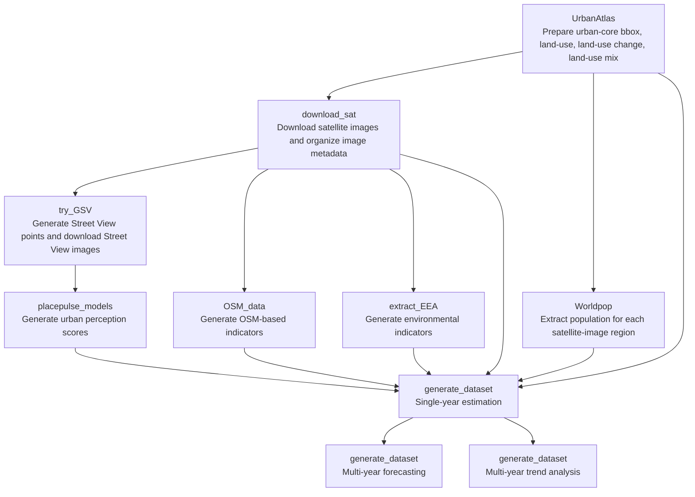

# UrbanWell

## Introduction
In this work, we introduce UrbanWell, a large-scale benchmark designed to systematically evaluate the spatio-temporal reasoning capabilities of MLLMs for urban wellbeing analytics through joint modeling of satellite and street view imagery. 

## Framework
UrbanWell is a large-scale benchmark designed to systematically evaluate the spatio-temporal reasoning capabilities of MLLMs for urban wellbeing analytics through joint modeling of satellite and street view imagery. UrbanWell spans 38 cities across multiple years and includes diverse indicators covering (1) environmental conditions (CO2, NO2, PM2.5, and normalized difference vegetation index), (2) spatial accessibility (minimum distance to supermarkets and restaurants), (3) urban form (road length, road density, and land use), (4) urban vitality (population, economic activity diversity, and land use diversity), and (5) subjective perception attributes (e.g., safety, beauty, liveliness, wealth, and quietness). All indicators are aligned at grid level to enable standardized evaluation. Beyond static prediction, UrbanWell defines temporal reasoning tasks, including future value forecasting from historical observations and temporal trend classification. We benchmark 15 representative state-of-the-art MLLMs under a zero-shot setting, providing a comprehensive comparative evaluation across spatial and temporal dimensions.


## Pipeline

The benchmark is constructed through a multi-stage pipeline, including data collection, indicator generation, task construction, and MLLM evaluation.


##  Benchmark Composition

The benchmark covers multiple indicator categories and task settings across cities and years. A detailed composition summary is provided below.


## Codes Structure for Evaluating UrbanWell
This directory contains the code files prepared for evaluating the UrbanWell benchmark, grouped by module:

- `benchmark_dataset`:
stores the released benchmark JSON files used for evaluation.
- `benchmark_dataset_rewritten`:
stores benchmark JSON files whose image paths have been rewritten to local `sat-image/` and `stv-image/` layouts.
- `evaluate/metadata`:
stores released or generated metadata files for downloading satellite and Street View images.
- `evaluate/download_sat_images_from_metadata.py`:
download satellite images from `metadata_sat` and organize them under `sat-image/`.
- `evaluate/download_stv_from_metadata.py`:
download Street View images from `metadata_stv` and organize them under `stv-image/`.
- `evaluate/rewrite_benchmark_image_paths.py`:
rewrite benchmark JSON image paths to local publish layouts before evaluation.
- `evaluate/global/metrics.py`:
run MLLM inference through OpenRouter, store model outputs, and compute `R2` and `RMSE`.
- `sat-image`:
stores downloaded satellite images for benchmark evaluation.
- `stv-image`:
stores downloaded Street View images for benchmark evaluation.

## Installation

Install Python dependencies.

```bash
conda create -n UrbanWell python==3.8
pip install -r requirements.txt
```

If you only need the evaluation pipeline, you can install the lighter evaluation-only dependencies:

```bash
pip install -r requirements-eval.txt
```

## UrbanWell Evaluation System User Guide

The current public release is designed to support benchmark evaluation using the provided metadata files and benchmark JSON files.

At a high level, the evaluation workflow is:
1. Use the provided metadata files to download or organize the required street view and satellite images.
2. Place the images into the expected local directories, for example `stv-image/` and `sat-image/`, and update the image paths in the benchmark JSON files if needed.
3. Run model inference on the benchmark JSON files.
4. Use the evaluation script to compute the final metrics such as `R2` and `RMSE`.

This release mainly focuses on evaluation-time usage: obtaining image data from metadata, placing the files into the corresponding directories, and running benchmark evaluation. Detailed support for the full benchmark construction pipeline, including raw ground-truth collection, intermediate processing, and benchmark generation, will be provided in the following sections.

### 1. Downloading Street View Images from metadata_stv.json

Download the full `metadata_stv.json` file from the Hugging Face dataset [XFengbao/UrbanWell](https://huggingface.co/datasets/XFengbao/UrbanWell) and use it to retrieve the required street view images. You can also generate the metadata locally with `evaluate/build_stv_metadata_from_benchmark.py`.

### 2. Downloading Satellite Images from metadata_sat.json

Download the full `metadata_sat.json` file from the Hugging Face dataset [XFengbao/UrbanWell](https://huggingface.co/datasets/XFengbao/UrbanWell) and use it to retrieve the required satellite images. You can also generate the metadata locally with `evaluate/build_sat_metadata_from_benchmark.py`.

This step depends on `downloader.exe` from Google Earth Images Downloader. Please install the tool first and make sure `downloader.exe` is available in your runtime environment before running `evaluate/download_sat_images_from_metadata.py`.

You can either place `downloader.exe` in the current working directory, add its folder to your system `PATH`, or pass the full path with `--downloader-exe`.

PowerShell example:

```powershell
python evaluate/download_sat_images_from_metadata.py path/to/metadata_sat.json --downloader-exe "C:\path\to\downloader.exe"
```

### 3. Running Evaluation

After the images are downloaded and the paths in the benchmark JSON files are updated to match your local directory structure, run model inference and then evaluate predictions with the scripts under `evaluate/`.

Before running the evaluation command, set your OpenRouter API key.

PowerShell example:

```powershell
$env:OPENROUTER_API_KEY = "your_openrouter_api_key"
```

OpenRouter CLI example:

```bash
python -m evaluate.global.metrics --model_name="openai/gpt-4o" --task_type="single" --task_name="population"
```

Supported arguments:
- `--model_name`: OpenRouter model name, using the OpenRouter model zoo naming format.
- `--task_type`: one of `single`, `multi_year_type1`, `multi_year_type3`.
- `--task_name`: indicator name, such as `population`, `NO2`, `beautiful`, or `avg_dist_to_restaurant`.
- `--benchmark_dir`: optional benchmark JSON directory. If omitted, the code uses `benchmark_dataset_rewritten/` when available, otherwise `benchmark_dataset/`.
- `--results_root`: output root directory for predictions and metric summaries. Default: `evaluate/results`.
- `--existing_mode`: one of `reuse`, `missing`, `rerun`.
- `--api_key`: optional OpenRouter API key passed directly from the command line.
- `--max_samples`: optional limit for debugging on a subset of samples.
- `--timeout`: HTTP timeout in seconds for each OpenRouter request.

## UrbanWell Benchmark Construction step 1: Data Collection

We will introduce the raw dataset collection procedures.

### 1.1 Urban Atlas Data
### 1.2 Satellite Image
### 1.3 Street View Image
### 1.4 Population Data
### 1.5 OSM Data
### 1.6 Environment Data

## UrbanWell Benchmark Construction step 2: Data Processing

## UrbanWell Benchmark Construction step 3: Task Construction

## UrbanWell Benchmark Construction step 4: MLLM Inference

## Workflow



## Recommended Order

1. Run `UrbanAtlas` to prepare urban boundaries, land-use, land-use change, and land-use mix.
2. Run `download_sat` to download satellite images and organize the image metadata.
3. Run `Worldpop`, `OSM_data`, and `extract_EEA` to generate satellite-region level indicators.
4. Run `try_GSV` to generate Street View points and download Street View images.
5. Run `placepulse_models` to generate urban perception scores from the Street View images.
6. Run `generate_dataset` to build:
   `single-year estimation`, `multi-year forecasting`, and `multi-year trend analysis` benchmarks.

## Notes

1. API keys have been removed from the submission copy.
   Scripts under `try_GSV` read the Google Street View API key from the `GOOGLE_KEY_MY` environment variable.

   Example:

   ```
   GOOGLE_KEY_MY = "your_google_api_key"
   ```

2. This submission folder keeps only the current processing scripts and simplified README files for each module.

3. The code in `generate_dataset` organizes the final tasks into:
   `single-year estimation`, `multi-year forecasting`, and `multi-year trend analysis`.

4. `benchmark_dataset` contains the final benchmark data.


