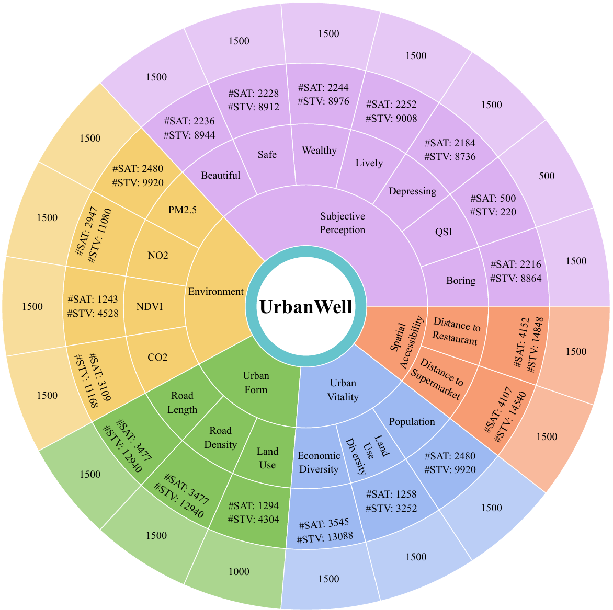
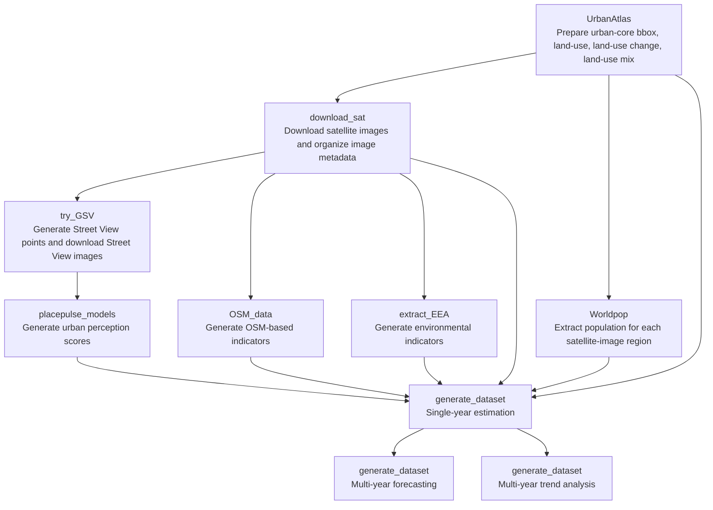

# UrbanWell

## Introduction
In this work, we introduce UrbanWell, a large-scale benchmark designed to systematically evaluate the spatio-temporal reasoning capabilities of MLLMs for urban wellbeing analytics through joint modeling of satellite and street view imagery. 

## Framework
UrbanWell is a large-scale benchmark designed to systematically evaluate the spatio-temporal reasoning capabilities of MLLMs for urban wellbeing analytics through joint modeling of satellite and street view imagery. UrbanWell spans 38 cities across multiple years and includes diverse indicators covering (1) environmental conditions (CO2, NO2, PM2.5, and normalized difference vegetation index), (2) spatial accessibility (minimum distance to supermarkets and restaurants), (3) urban form (road length, road density, and land use), (4) urban vitality (population, economic activity diversity, and land use diversity), and (5) subjective perception attributes (e.g., safety, beauty, liveliness, wealth, and quietness). All indicators are aligned at grid level to enable standardized evaluation. Beyond static prediction, UrbanWell defines temporal reasoning tasks, including future value forecasting from historical observations and temporal trend classification. We benchmark 15 representative state-of-the-art MLLMs under a zero-shot setting, providing a comprehensive comparative evaluation across spatial and temporal dimensions.


## Pipeline

The benchmark is constructed through a multi-stage pipeline, including data collection, indicator generation, task construction, and MLLM evaluation.


##  Benchmark Composition

The benchmark covers multiple indicator categories and task settings across cities and years. A detailed composition summary is provided below.




## Codes Structure for Evaluating UrbanWell
This directory contains the code files prepared for evaluating the UrbanWell benchmark, grouped by module:

- `benchmark_dataset`:
stores the released benchmark JSON files used for evaluation.
- `benchmark_dataset_rewritten`:
stores benchmark JSON files whose image paths have been rewritten to local `sat-image/` and `stv-image/` layouts.
- `evaluate/metadata`:
stores released or generated metadata files for downloading satellite and Street View images.
- `evaluate/download_sat_images_from_metadata.py`:
download satellite images from `metadata_sat` and organize them under `sat-image/`.
- `evaluate/download_stv_from_metadata.py`:
download Street View images from `metadata_stv` and organize them under `stv-image/`.
- `evaluate/rewrite_benchmark_image_paths.py`:
rewrite benchmark JSON image paths to local publish layouts before evaluation.
- `evaluate/global/metrics.py`:
run MLLM inference through OpenRouter, store model outputs, and compute `R2` and `RMSE`.
- `sat-image`:
stores downloaded satellite images for benchmark evaluation.
- `stv-image`:
stores downloaded Street View images for benchmark evaluation.

## What Is Fully Supported

The current public submission is strongest for the following use cases:
- downloading released satellite and Street View images from metadata for benchmark evaluation
- rewriting benchmark JSON image paths to local `sat-image/` and `stv-image/` layouts
- running OpenRouter-based evaluation and computing `R2` and `RMSE`
- understanding the high-level benchmark construction workflow through the documented module structure
- reusing the clearer benchmark-construction scripts whose input and output directories are now exposed near the top of the file

In practice, the most stable public path is:
- use the released benchmark JSON files
- use the released metadata files or regenerate them locally
- download the images
- run evaluation

## What Is Kept As Reference

Some construction scripts are still included mainly as reference implementations of the original research workflow rather than as polished, end-to-end public commands.

This especially applies to steps such as:
- generating Street View sampling points inside satellite-image regions
- searching and selecting historical panoramas across years
- semantic filtering and additional Street View cleaning
- some OSM and environmental preprocessing scripts that still assume specific raw filename layouts or historical workspace exceptions

These scripts are still useful because they document how the original benchmark was built, but users of the public release do not need to run all of them in order to use the benchmark or reproduce the released evaluation pipeline.

## Installation

Install Python dependencies.

```bash
conda create -n UrbanWell python==3.8
pip install -r requirements.txt
```

If you only need the evaluation pipeline, you can install the lighter evaluation-only dependencies:

```bash
pip install -r requirements-eval.txt
```

## UrbanWell Evaluation System User Guide

The current public release is designed to support benchmark evaluation using the provided metadata files and benchmark JSON files.

At a high level, the evaluation workflow is:
1. Use the provided metadata files to download or organize the required street view and satellite images.
2. Place the images into the expected local directories, for example `stv-image/` and `sat-image/`, and update the image paths in the benchmark JSON files if needed.
3. Run model inference on the benchmark JSON files.
4. Use the evaluation script to compute the final metrics such as `R2` and `RMSE`.

This release mainly focuses on evaluation-time usage: obtaining image data from metadata, placing the files into the corresponding directories, and running benchmark evaluation. Detailed support for the full benchmark construction pipeline, including raw ground-truth collection, intermediate processing, and benchmark generation, will be provided in the following sections.

### 1. Downloading Street View Images from metadata_stv.json

Download the full `metadata_stv.json` file from the Hugging Face dataset [XFengbao/UrbanWell](https://huggingface.co/datasets/XFengbao/UrbanWell) and use it to retrieve the required street view images. You can also generate the metadata locally with `evaluate/build_stv_metadata_from_benchmark.py`.

### 2. Downloading Satellite Images from metadata_sat.json

Download the full `metadata_sat.json` file from the Hugging Face dataset [XFengbao/UrbanWell](https://huggingface.co/datasets/XFengbao/UrbanWell) and use it to retrieve the required satellite images. You can also generate the metadata locally with `evaluate/build_sat_metadata_from_benchmark.py`.

This step depends on `downloader.exe` from Google Earth Images Downloader. Please install the tool first and make sure `downloader.exe` is available in your runtime environment before running `evaluate/download_sat_images_from_metadata.py`.

You can either place `downloader.exe` in the current working directory, add its folder to your system `PATH`, or pass the full path with `--downloader-exe`.

PowerShell example:

```powershell
python evaluate/download_sat_images_from_metadata.py path/to/metadata_sat.json --downloader-exe "C:\path\to\downloader.exe"
```

### 3. Running Evaluation

After the images are downloaded and the paths in the benchmark JSON files are updated to match your local directory structure, run model inference and then evaluate predictions with the scripts under `evaluate/`.

Before running the evaluation command, set your OpenRouter API key.

PowerShell example:

```powershell
$env:OPENROUTER_API_KEY = "your_openrouter_api_key"
```

OpenRouter CLI example:

```bash
python -m evaluate.global.metrics --model_name="openai/gpt-4o" --task_type="single" --task_name="population"
```

Supported arguments:
- `--model_name`: OpenRouter model name, using the OpenRouter model zoo naming format.
- `--task_type`: one of `single`, `multi_year_type1`, `multi_year_type3`.
- `--task_name`: indicator name, such as `population`, `NO2`, `beautiful`, or `avg_dist_to_restaurant`.
- `--benchmark_dir`: optional benchmark JSON directory. If omitted, the code uses `benchmark_dataset_rewritten/` when available, otherwise `benchmark_dataset/`.
- `--results_root`: output root directory for predictions and metric summaries. Default: `evaluate/results`.
- `--existing_mode`: one of `reuse`, `missing`, `rerun`.
- `--api_key`: optional OpenRouter API key passed directly from the command line.
- `--max_samples`: optional limit for debugging on a subset of samples.
- `--timeout`: HTTP timeout in seconds for each OpenRouter request.

## UrbanWell Benchmark Construction step 1: Data Collection

We introduce the raw data sources used to construct UrbanWell. The current codebase combines data collected from multiple external systems, so the full end-to-end collection workflow is relatively heterogeneous. This section summarizes the source websites, how the data are obtained, where the files are expected to be placed, and which scripts use them next.

### 1.1 Urban Atlas Data

Raw datasets:
- urban core boundary
- land use
- NDVI-related land cover inputs

Source website:
- [Copernicus](https://www.copernicus.eu/en)

How to obtain:
- download the Urban Atlas products for the target cities or functional urban areas from the Copernicus portal
- keep the original archive structure so the unzip and preprocessing scripts can be applied directly

Where to place the files:
- place the raw Urban Atlas archives under the `UrbanAtlas/` workspace used by the preprocessing scripts
- the extracted files are then organized under directories such as `UrbanAtlas/unziped_files_LU_2012/`, `UrbanAtlas/unziped_files_LU_2018/`, and `UrbanAtlas/unziped_files_LU_change/`

Scripts used next:
- `UrbanAtlas/unzip_all_files.py`
- `UrbanAtlas/generate_bbox_lonlat_urbancore_MoreCity.py`
- `UrbanAtlas/calculate_change_centroids_MoreCity.py`
- `UrbanAtlas/read_centroids_and_generate_bbox_for_sat_MoreCity.py`
- `UrbanAtlas/landuse_MoreCity.py`
- `UrbanAtlas/landuse_mix_MoreCity.py`

### 1.2 Satellite Image

Raw dataset:
- satellite imagery

Source website / tool:
- Google Earth

How to obtain:
- install Google Earth Images Downloader and use `downloader.exe` to collect satellite images based on the prepared bounding boxes
- the repository provides scripts that automate this process after the Urban Atlas bounding boxes have been prepared

Where to place the files:
- the raw downloader outputs are expected under `download_sat/outputs/downloaded_sat_<YEAR>_zoom_16/`
- metadata and log files produced by the downloader are stored alongside the downloaded image folders

Scripts used next:
- `download_sat/download_sat_image_any_year_zoom_16_MoreCity.py`
- `download_sat/filter_sat_images_in_boundary.py`
- `download_sat/image_intersect_polygon_MoreCity.py`

### 1.3 Street View Image

Raw dataset:
- street view imagery

Source website / API:
- Google Map

How to obtain:
- generate sampling points for each satellite-image region
- query panoramas through the Google Street View API
- download the selected Street View images for the chosen years and headings

Where to place the files:
- Street View image outputs are organized under `try_GSV/outputs/downloaded_stv_selected/`
- intermediate files such as sampling points and panorama caches are stored under `try_GSV/outputs/generated_grid_points/` and `try_GSV/outputs/PANO_ID_PKL/`

Scripts used next:
- `try_GSV/generate_stv_points_MoreCity.py` (first verify the top-of-file constants such as `CITY_LIST_PATH`, `LANDUSE_CHANGE_DIR`, `OUTPUT_ROOT`, `NUM_ROWS`, and `NUM_COLS`)
- `try_GSV/download_GSV_years_MoreCity_pp.py`
- `try_GSV/try_download_GSV_selected_date.py`

Notes:
- the current workflow uses the Google Street View API
- the API key is read from the `GOOGLE_KEY_MY` environment variable

### 1.4 Population Data

Raw dataset:
- population

Source website:
- [World Population Review](https://worldpopulationreview.com/)

How to obtain:
- use the city population table for city selection and reference metadata
- download WorldPop raster files for the years and regions used in the benchmark pipeline

Where to place the files:
- city-selection related files are stored under `Worldpop/outputs/city_selection/`
- downloaded raster files are stored under `Worldpop/outputs/worldpop_rasters/`

Scripts used next:
- `Worldpop/select_most_populated_cities_EU.py`
- `Worldpop/download_world_pop.py` (check `EUROPE_ISO3`, `YEARS`, and `OUTPUT_DIR` at the top of the script)
- `Worldpop/extract_world_pop_MoreCity.py`

### 1.5 OSM Data

Raw datasets:
- OSM road network
- OSM POI data

Source website:
- [Geofabrik](https://www.geofabrik.de/)

How to obtain:
- download the required OSM extracts for the target countries or cities from Geofabrik
- unzip and preprocess the OSM files into road-network and POI layers used by the indicator scripts

Where to place the files:
- raw OSM downloads are stored under `OSM_data/outputs/osm_raw_data/`
- unzipped and processed files are stored under `OSM_data/outputs/unzipped_osm_files/` and `OSM_data/outputs/processed_osm_data/`

Scripts used next:
- `OSM_data/download_osm_data.py`
- `OSM_data/exclude_non_commercial_pois.py`
- `OSM_data/diversity_of_economic_activity_any_year_MoreCity.py` (check path constants such as `CITY_TABLE_PATH`, `URBANCORE_BBOX_DIR`, `DOWNLOAD_SAT_OUTPUT_ROOT`, and `OUTPUT_DIR`)
- `OSM_data/generate_road_access_only_dist_poi.py`
- `OSM_data/generate_road_access_update_mp_update.py`

### 1.6 Environment Data

Raw datasets:
- CO2
- NO2
- PM2.5
- QSI

Source websites:
- CO2: [ODIAC](https://odiac.org/index.html)
- NO2, PM2.5, QSI: [EEA](https://www.eea.europa.eu/en)

How to obtain:
- manually download the environmental rasters or tabular products from the corresponding source websites
- organize them into the raw-data directory expected by the extraction scripts

Where to place the files:
- the raw environmental files are expected under `extract_EEA/outputs/eea_raw_data/`
- generated outputs are then written to folders such as `extract_EEA/outputs/generated_CO2/`, `extract_EEA/outputs/generated_NO2/`, `extract_EEA/outputs/generated_PM25/`, and `extract_EEA/outputs/generated_QSI/`

Scripts used next:
- `extract_EEA/generate_NDVI_Copernicus.py` (first verify the top-of-file constants such as `CITY_TABLE_PATH`, `URBANCORE_BBOX_DIR`, and `OUTPUT_DIR`)
- `extract_EEA/extract_CO2_1km.py` (check path constants such as `ODIAC_RAW_DIR`, `DOWNLOAD_SAT_OUTPUT_ROOT`, `GENERATED_CO2_ROOT`, and `YEARS`)
- `extract_EEA/extract_NDVI.py`
- `extract_EEA/extract_NO2.py`
- `extract_EEA/extract_PM25.py`
- `extract_EEA/extract_quite_area.py`

## UrbanWell Benchmark Construction step 2: Data Processing

After the raw data are collected, the benchmark construction workflow proceeds through a sequence of intermediate processing stages. The key goal of this step is to align all heterogeneous sources to the same satellite-image regions so that later task-construction scripts can combine them into unified benchmark samples.

### 2.1 Urban region preparation

Module:
- `UrbanAtlas`

Main processing logic:
- unzip and organize the Urban Atlas source files
- generate urban-core bounding boxes in longitude/latitude
- extract land-use-change centroids within the urban-core area
- convert centroids into bounding boxes for satellite-image download
- assign land-use and land-use-mix values to the final satellite-image regions

Main outputs:
- `UrbanAtlas/outputs/urbancore_bbox_dir/`
- `UrbanAtlas/outputs/urbanchange_centroids_dir/`
- `UrbanAtlas/outputs/output_LU_single_year/`
- `UrbanAtlas/outputs/output_LU_mix_dir/`
- `UrbanAtlas/outputs/landuse_reference/`

Used next by:
- `download_sat`
- `generate_dataset`

### 2.2 Satellite-image preparation

Module:
- `download_sat`

Main processing logic:
- use the UrbanAtlas bounding boxes to download yearly satellite images
- organize downloader logs and image metadata
- filter valid images inside the target boundary
- match satellite-image footprints with Urban Atlas change polygons
- determine the selected satellite-image regions used by the later modules

Main outputs:
- `download_sat/outputs/downloaded_sat_<YEAR>_zoom_16/`
- `download_sat/outputs/valid_image_lists/`
- `download_sat/outputs/Landuse_Change_2012_2018_urbancore/`
- `download_sat/outputs/downloaded_sat_for_stv_zoom_16/`

Used next by:
- `Worldpop`
- `OSM_data`
- `extract_EEA`
- `try_GSV`
- `generate_dataset`

### 2.3 Region-level indicator generation

This stage computes structured indicators for the same satellite-image regions using different source-specific modules.

Population:
- module: `Worldpop`
- processing: download or organize yearly WorldPop rasters and extract population values for each selected satellite-image region
- outputs: `Worldpop/outputs/output_popu_dir/`

OSM-based accessibility and economic activity:
- module: `OSM_data`
- processing: download Geofabrik extracts, retain the required roads and POIs, and calculate road length, road density, accessibility, and economic diversity indicators for each region
- outputs: `OSM_data/outputs/output_economic_dir_update/`, `OSM_data/outputs/accessability_output_only_POI_update/`, and `OSM_data/outputs/road-output/`

Environmental indicators:
- module: `extract_EEA`
- processing: organize raw ODIAC and EEA files, build NDVI matching boxes, and extract environmental values for each selected satellite-image region
- outputs: `extract_EEA/outputs/generated_CO2/`, `extract_EEA/outputs/generated_NDVI/`, `extract_EEA/outputs/generated_NO2/`, `extract_EEA/outputs/generated_PM25/`, and `extract_EEA/outputs/generated_QSI/`

These outputs are later merged by `generate_dataset`.

### 2.4 Street View preparation and visual-score generation

Street View preparation:
- module: `try_GSV`
- logic: generate grid points, query panoramas, download Street View images, run semantic segmentation, and filter unusable indoor or non-roadside views
- outputs: `try_GSV/outputs/downloaded_stv_selected/`, `try_GSV/outputs/generated_grid_points/`, `try_GSV/outputs/PANO_ID_PKL/`, and `try_GSV/outputs/final_dataset/`

Urban perception scoring:
- module: `placepulse_models`
- logic: run pretrained visual-perception models on the selected Street View images and export per-attribute scores such as beauty, safety, liveliness, wealth, boredom, and depression
- outputs: `placepulse_models/outputs/output_stv_selected/`

These outputs are later consumed by `generate_dataset` for urban-perception related tasks.

### 2.5 Unified benchmark input assembly

Module:
- `generate_dataset`

Main processing logic:
- read all processed region-level indicators and image-path information
- align them by city, satellite-image region, and year
- combine satellite images, Street View images, prompts, and references into structured task samples
- reuse `generate_dataset/inputs/sat_stv_list_dir/` to map satellite-image regions to the associated Street View image groups
- reuse `generate_dataset/inputs/generated_QA/` for perception-related support files when constructing urban-perception tasks

Main intermediate outputs:
- `generate_dataset/outputs/single_year/`
- `generate_dataset/outputs/multi_year_type1/`
- `generate_dataset/outputs/multi_year_type3/`

## UrbanWell Benchmark Construction step 3: Task Construction

The processed indicators are converted into benchmark tasks under three settings.

### 3.1 Single-year estimation

Scripts:
- `generate_dataset/single_year/construct_dataset_any_indicator_single_year.py`
- `generate_dataset/single_year/construct_dataset_LU_single_year.py`
- `generate_dataset/single_year/construct_dataset_popu_single_year.py`
- `generate_dataset/single_year/construct_dataset_UrbanPerception_single_year.py`

Task characteristics:
- estimate one indicator for one target year from the corresponding satellite and Street View imagery
- output format is either a numeric value or a discrete land-use label, depending on the indicator
- generated files are written under `generate_dataset/outputs/single_year/<CITY_NAME>/`

Typical inputs consumed here:
- environmental CSV files from `extract_EEA`
- population CSV files from `Worldpop`
- road, accessibility, and economic CSV files from `OSM_data`
- land-use CSV files from `UrbanAtlas`
- Street View perception scores from `placepulse_models`
- satellite/Street View correspondence files under `generate_dataset/inputs/sat_stv_list_dir/`

### 3.2 Multi-year forecasting

Scripts:
- `generate_dataset/multi_year_type1/construct_dataset_any_indicator_multi_year_type1.py`
- `generate_dataset/multi_year_type1/construct_dataset_LU_multi_year.py`
- `generate_dataset/multi_year_type1/construct_dataset_popu_multi_year_type1.py`

Task characteristics:
- use a sequence of earlier years as context and predict the indicator value for the final year
- generated files are written under `generate_dataset/outputs/multi_year_type1/<CITY_NAME>/`
- helper files with names such as `*_single_year_selected_type1_*.json` store the sampled single-year subsets used to construct the forecasting benchmark

### 3.3 Multi-year trend analysis

Scripts:
- `generate_dataset/multi_year_type3/construct_dataset_any_indicator_multi_year_type3.py`
- `generate_dataset/multi_year_type3/construct_dataset_popu_multi_year_type3.py`

Task characteristics:
- use imagery from multiple years and classify the change between adjacent years as `positive`, `negative`, or `no change`
- generated files are written under `generate_dataset/outputs/multi_year_type3/<CITY_NAME>/`
- helper files with names such as `*_single_year_selected_type3_*.json` store the sampled single-year subsets used to construct the trend-analysis benchmark

### 3.4 Final benchmark release files

Script:
- `generate_dataset/extract_final_500_dataset.py`

Main processing logic:
- scan `generate_dataset/outputs/single_year/`, `generate_dataset/outputs/multi_year_type1/`, and `generate_dataset/outputs/multi_year_type3/`
- group generated task files by indicator
- perform balanced sampling to produce the released benchmark files with up to 500 samples per indicator and task type
- write the final release files to `generate_dataset/outputs/final_benchmark/`
- collect the released JSON files into `benchmark_dataset/`

## UrbanWell Benchmark Construction step 4: MLLM Inference

After the benchmark JSON files are prepared, MLLM inference can be run either in the original research environment or through the lightweight evaluation pipeline included in this repository.

### 4.1 Benchmark JSON format

Each released benchmark JSON item stores the information needed for evaluation, including:
- `images`: ordered image paths for the sample
- `prompt`: the task prompt shown to the model
- `references`: the ground-truth value or label
- metadata fields such as `years`, `city_name`, `ids`, and image identifiers

### 4.2 Released evaluation pipeline in this repository

Relevant scripts:
- `evaluate/download_sat_images_from_metadata.py`
- `evaluate/download_stv_from_metadata.py`
- `evaluate/rewrite_benchmark_image_paths.py`
- `evaluate/global/metrics.py`

Main processing logic:
- download or organize the required images from metadata files
- rewrite benchmark image paths to local `sat-image/` and `stv-image/` layouts
- call OpenRouter-compatible MLLMs with the benchmark prompt and local images
- save model outputs and compute `R2` and `RMSE`

### 4.3 Stored outputs during evaluation

The evaluation pipeline stores:
- downloaded images under `sat-image/` and `stv-image/`
- rewritten benchmark JSON files under `benchmark_dataset_rewritten/`
- model predictions under `evaluate/results/<MODEL_NAME>/<TASK_TYPE>/<TASK_NAME>/predictions.json`
- metric summaries under `evaluate/results/<MODEL_NAME>/<TASK_TYPE>/<TASK_NAME>/summary.json`

## Workflow



## End-to-End Minimal Checklist

This checklist is intended as the most practical reading path for the construction code. For each step, first confirm the top-of-file path constants in the relevant scripts and make sure the required input folders already exist.

1. Prepare the raw source files.
- Put Urban Atlas archives under `UrbanAtlas/` and preserve the expected unzip structure.
- Install Google Earth Images Downloader and make `downloader.exe` available.
- Prepare WorldPop rasters, OSM raw files, and EEA / ODIAC raw files under their module `outputs/` folders.
- Set `GOOGLE_KEY_MY` before running the Street View download scripts.

2. Build the urban-core and land-use intermediates in `UrbanAtlas`.
- Run `unzip_all_files.py`.
- Run `generate_bbox_lonlat_urbancore_MoreCity.py` to produce `UrbanAtlas/outputs/urbancore_bbox_dir/`.
- Run `calculate_change_centroids_MoreCity.py` and `read_centroids_and_generate_bbox_for_sat_MoreCity.py` to produce `UrbanAtlas/outputs/urbanchange_centroids_dir/`.
- Run `landuse_MoreCity.py` and `landuse_mix_MoreCity.py` to produce `UrbanAtlas/outputs/output_LU_single_year/` and `UrbanAtlas/outputs/output_LU_mix_dir/`.

3. Download and filter the satellite-image regions in `download_sat`.
- Run `download_sat_image_any_year_zoom_16_MoreCity.py` to create `download_sat/outputs/downloaded_sat_<YEAR>_zoom_16/`.
- Run `filter_sat_images_in_boundary.py` to create `download_sat/outputs/valid_image_lists/valid_image_lists.csv`.
- Run `image_intersect_polygon_MoreCity.py` to create `download_sat/outputs/Landuse_Change_2012_2018_urbancore/`.

4. Generate structured satellite-region indicators.
- In `Worldpop`, run `download_world_pop.py` and `extract_world_pop_MoreCity.py` to create `Worldpop/outputs/output_popu_dir/`.
- In `OSM_data`, run at least `exclude_non_commercial_pois.py`, `diversity_of_economic_activity_any_year_MoreCity.py`, and `generate_road_access_update_mp_update.py`. If you want all original accessibility variants, check the top-of-file constants and legacy path assumptions before running the heavier OSM scripts.
- In `extract_EEA`, run `generate_NDVI_Copernicus.py`, `extract_CO2_1km.py`, and then the other environmental extraction scripts after aligning their raw input filenames with your local `outputs/eea_raw_data/` layout.

5. Generate and download Street View imagery.
- In `try_GSV`, run `generate_stv_points_MoreCity.py` to create `try_GSV/outputs/generated_grid_points/`.
- Run `download_GSV_years_MoreCity_pp.py` to read `try_GSV/outputs/generated_grid_points/`, cache pano metadata under `try_GSV/outputs/PANO_ID_PKL/`, and write downloaded Street View images plus `street_image_list.csv` files under `try_GSV/outputs/downloaded_stv_selected/`.
- Run the semantic-segmentation and indoor/outdoor filtering scripts if you want to reproduce the original Street View cleaning pipeline.

6. Generate urban-perception scores.
- Place the pretrained checkpoints under `placepulse_models/pretrained_weights/`.
- Run `placepulse_models/eval_two_years_MoreCity_pp.py` to create `placepulse_models/outputs/output_stv_selected/`.

7. Assemble benchmark task files in `generate_dataset`.
- Make sure `generate_dataset/inputs/sat_stv_list_dir/` and `generate_dataset/inputs/generated_QA/` contain the correspondence and support files required by the dataset scripts.
- Run the scripts under `generate_dataset/single_year/`.
- Run the scripts under `generate_dataset/multi_year_type1/`.
- Run the scripts under `generate_dataset/multi_year_type3/`.

8. Produce the released benchmark JSON files.
- Run `generate_dataset/extract_final_500_dataset.py`.
- Collect the sampled release files under `benchmark_dataset/`.

## Recommended Order

1. Run `UrbanAtlas` to prepare urban boundaries, land-use, land-use change, and land-use mix.
2. Run `download_sat` to download satellite images and organize the image metadata.
3. Run `Worldpop`, `OSM_data`, and `extract_EEA` to generate satellite-region level indicators.
4. Run `try_GSV` to generate Street View points and download Street View images.
5. Run `placepulse_models` to generate urban perception scores from the Street View images.
6. Run `generate_dataset` to build:
   `single-year estimation`, `multi-year forecasting`, and `multi-year trend analysis` benchmarks.

## Notes

1. API keys have been removed from the submission copy.
   Scripts under `try_GSV` read the Google Street View API key from the `GOOGLE_KEY_MY` environment variable.

   Example:

   ```
   GOOGLE_KEY_MY = "your_google_api_key"
   ```

2. This submission folder keeps only the current processing scripts and simplified README files for each module.

3. The code in `generate_dataset` organizes the final tasks into:
   `single-year estimation`, `multi-year forecasting`, and `multi-year trend analysis`.

4. `benchmark_dataset` contains the final benchmark data.


