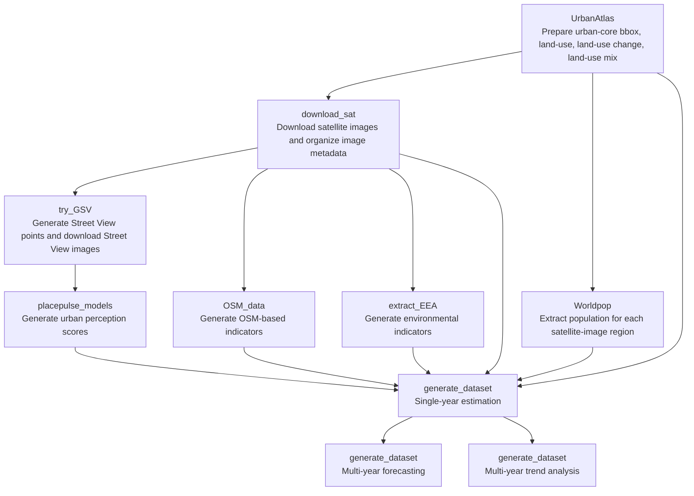

# UrbanWell

## Introduction
In this work, we introduce UrbanWell, a large-scale benchmark designed to systematically evaluate the spatio-temporal reasoning capabilities of MLLMs for urban wellbeing analytics through joint modeling of satellite and street view imagery. 

## Framework
UrbanWell is a large-scale benchmark designed to systematically evaluate the spatio-temporal reasoning capabilities of MLLMs for urban wellbeing analytics through joint modeling of satellite and street view imagery. UrbanWell spans 38 cities across multiple years and includes diverse indicators covering (1) environmental conditions (CO2, NO2, PM2.5, and normalized difference vegetation index), (2) spatial accessibility (minimum distance to supermarkets and restaurants), (3) urban form (road length, road density, and land use), (4) urban vitality (population, economic activity diversity, and land use diversity), and (5) subjective perception attributes (e.g., safety, beauty, liveliness, wealth, and quietness). All indicators are aligned at grid level to enable standardized evaluation. Beyond static prediction, UrbanWell defines temporal reasoning tasks, including future value forecasting from historical observations and temporal trend classification. We benchmark 15 representative state-of-the-art MLLMs under a zero-shot setting, providing a comprehensive comparative evaluation across spatial and temporal dimensions. Experimental results indicate that while MLLMs capture salient spatial and perceptual cues, their performance varies substantially across heterogeneous urban indicators spanning environment and subjective perception. UrbanWell serves as a unified benchmark for evaluating multimodal spatial and temporal reasoning in urban wellbeing analytics, offering a standardized testbed for systematic assessment and future research on multimodal urban intelligence.


*Figure 1. Overview of the UrbanWell benchmark, including the data sources, indicator domains, city coverage, and the three task paradigms.*

## Pipeline

The benchmark is constructed through a multi-stage pipeline, including data collection, indicator generation, task construction, and MLLM evaluation.


*Figure 2. End-to-end pipeline of UrbanWell, from multimodal data collection and processing to benchmark construction and MLLM inference.*

##  Benchmark Composition

The benchmark covers multiple indicator categories and task settings across cities and years. A detailed composition summary is provided below.


## Codes Structure
This directory contains the code files prepared for constructing the UrbanWell dataset, grouped by module:

- `UrbanAtlas`:
prepare Urban Atlas based inputs, including satellite-image boundaries, land-use data, land-use change data, and land-use mix.
- `download_sat`:
download satellite imagery and organize the image metadata used by the later modules.
- `Worldpop`:
download WorldPop population raster files and generate population values for each satellite-image region.
- `try_GSV`:
generate Street View sampling points, download Street View images, and prepare Street View metadata.
- `placepulse_models`:
use pretrained models to generate urban perception scores from Street View images.
- `OSM_data`:
download OSM raw data and generate accessibility and economic activity related indicators.
- `extract_EEA`:
download environmental raw data and generate CO2, NDVI, NO2, PM2.5, and quiet-area related indicators.
- `generate_dataset`:
construct the final benchmark datasets for single-year estimation, multi-year forecasting, and multi-year trend analysis.

## Installation

Install Python dependencies.

```bash
conda create -n citylens python==3.10
pip install -r requirements.txt
```

## Workflow



## Recommended Order

1. Run `UrbanAtlas` to prepare urban boundaries, land-use, land-use change, and land-use mix.
2. Run `download_sat` to download satellite images and organize the image metadata.
3. Run `Worldpop`, `OSM_data`, and `extract_EEA` to generate satellite-region level indicators.
4. Run `try_GSV` to generate Street View points and download Street View images.
5. Run `placepulse_models` to generate urban perception scores from the Street View images.
6. Run `generate_dataset` to build:
   `single-year estimation`, `multi-year forecasting`, and `multi-year trend analysis` benchmarks.

## Notes

1. API keys have been removed from the submission copy.
   Scripts under `try_GSV` read the Google Street View API key from the `GOOGLE_KEY_MY` environment variable.

   Example:

   ```
   GOOGLE_KEY_MY = "your_google_api_key"
   ```

2. This submission folder keeps only the current processing scripts and simplified README files for each module.

3. The code in `generate_dataset` organizes the final tasks into:
   `single-year estimation`, `multi-year forecasting`, and `multi-year trend analysis`.

4. `benchmark_dataset` contains the final benchmark data.
